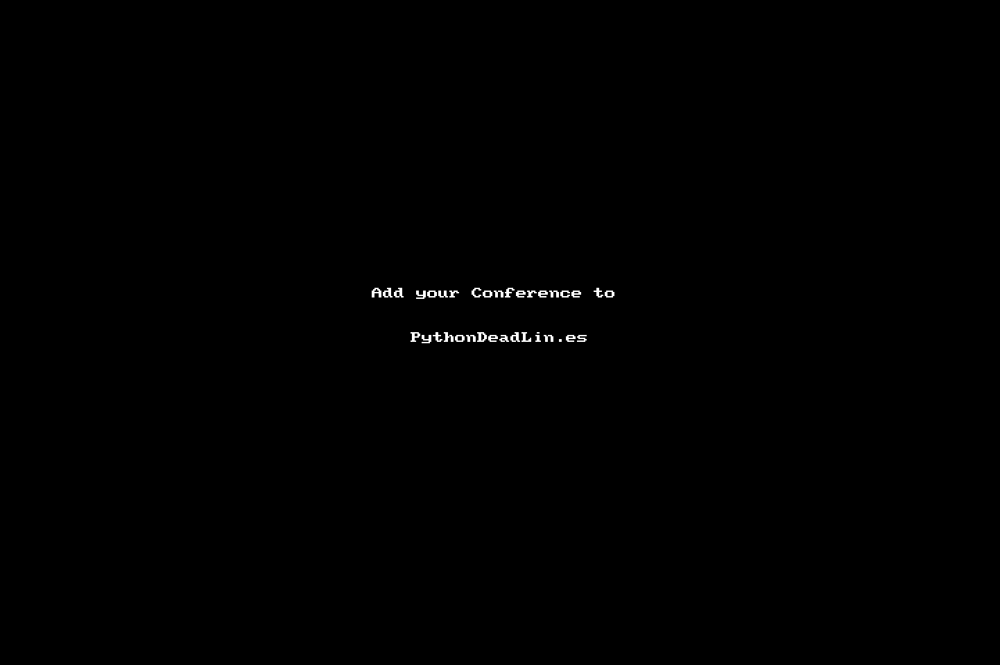

## Python Deadlines

[](https://github.com/JesperDramsch/python-deadlines/actions/workflows/pages/pages-build-deployment)  [](#contributors) 

Countdown timers to keep track of a bunch of Python conference deadlines.

## Contributing

Contributions are very welcome!



To add or update a deadline:

-   Fork the repository
-   Update `_data/conferences.yml`
-   Make sure it has the `conference`, `year`, `link`, `cfp`, `place`, `sub` attributes
    -   This [online web app](https://timezonefinder.michelfe.it/) makes it easy to find timezones – just click!
        (Based on [timezonefinder](https://github.com/jannikmi/timezonefinder) library)
    -   Alternatively, see available timezone strings [here](https://momentjs.com/timezone/).
-   Optionally add a `note`
-   Send a [pull request](_data/conferences.yml)

### Examples

#### Minimal Submission

```yaml
- conference: BestConf # Title of conference
  year: 2022 # Year
  link: link-to-website.com # URL to conference
  cfp: 'YYYY-MM-DD HH:mm:ss' # Deadline for Call for Participation / Proposals
  place: Incheon, South Korea # City, Country# Nicely written dates of conference
  start: YYYY-MM-DD # Start date of conference for calendar
  end: YYYY-MM-DD # End date of conference for calendar
  sub: PY # Type of conference (see or add _data/types.yml)
```

#### Full Data

```yaml
- conference: BestConf # Title of conference
  alt_name: Bestest Conf # Names change, keep track of Alternate names here
  year: 2022 # Year
  link: link-to-website.com # URL to conference
  cfp_link: link-to-cfp.com # URL to call for proposals (Optional)
  cfp: 'YYYY-MM-DD HH:mm:ss' # Deadline for Call for Participation / Proposals
  cfp_ext: 'YYYY-MM-DD HH:mm:ss' # Extension of Deadline for Call for Participation / Proposals
  workshop_deadline: 'YYYY-MM-DD HH:mm:ss' # Workshop deadline if different from cfp (Optional)
  tutorial_deadline: 'YYYY-MM-DD HH:mm:ss' # Tutorial deadline if different from cfp (Optional)
  timezone: Asia/Seoul # Standard IANA Timezones (Omit for AoE)
  place: Incheon, South Korea # City, Country# Nicely written dates of conference
  start: YYYY-MM-DD # Start date of conference for calendar
  end: YYYY-MM-DD # End date of conference for calendar
  sponsor: link-to-sponsor.page # URL to Sponsorship page (Optional)
  finaid: link-to-finaid.page # URL to Financial Aid page (Optional)
  twitter: BestConfEver # Twitter handle of conference (Optional)
  mastodon: https://mastodon.social/@bconf # Mastodon handle of conference (Optional)
  sub: PY # Type of conference (see or add _data/types.yml)
  note: Important # In case there are extra notes about the conference (Optional)
  location: # Geolocation for inclusion in map
      latitude: 0.00
      longitude: 0.00
```

### Description of entries

| `sub`               | Description                                                                   | Type    | Required |
| ------------------- | ----------------------------------------------------------------------------- | ------- | -------- |
| `conference`        | Title of the conference                                                       | `str`   | ✔        |
| `alt_name`          | Alternative Name of conference                                                | `str`   |          |
| `year`              | Year of this conference                                                       | `int`   | ✔        |
| `link`              | URL to conference                                                             | `str`   | ✔        |
| `cfp_link`          | URL to call for proposals                                                     | `str`   |          |
| `cfp`               | Deadline for Call for Participation / Proposals                               | `str`   | ✔        |
| `cfp_ext`           | Extension for Call for Participation / Proposals                              | `str`   |          |
| `workshop_deadline` | Workshop deadline if different from cfp                                       | `str`   |          |
| `tutorial_deadline` | Tutorial deadline if different from cfp                                       | `str`   |          |
| `timezone`          | Standard [IANA Timezones](https://timezonefinder.michelfe.it/) (Omit for AoE) | `str`   |          |
| `place`             | City, Country                                                                 | `str`   | ✔        |
| `start`             | Start date of conference for calendar                                         | `date`  | ✔        |
| `end`               | End date of conference for calendar                                           | `date`  | ✔        |
| `finaid`            | URL to financial aid information                                              | `str`   |          |
| `sponsor`           | URL to sponsorship opportunities                                              | `str`   |          |
| `twitter`           | Twitter handle of conference                                                  | `str`   |          |
| `mastodon`          | Mastodon handle of conference                                                 | `str`   |          |
| `sub`               | Type of conference                                                            | `str`   | ✔        |
| `note`              | Extra notes about the conference                                              | `str`   |          |
| `location`          | Geolocation for inclusion in map                                              | `str`   |          |
| `latitude`          | Latitude of venue                                                             | `float` |          |
| `longitude`         | Longitude of venue                                                            | `float` |          |

### Conference types for `sub`

| `sub`   | Category name       |
| ------- | ------------------- |
| `PY`    | General Python      |
| `SCIPY` | Scientific Python   |
| `DATA`  | Python for Data     |
| `WEB`   | Python for Web      |
| `BIZ`   | Python for Business |
| `GEO`   | Python for Earth    |

### Utils

I have created extensive scripts to import data from other sources and tidy up entries.

Check out the utils folder for those.

I mainly run the `main.py` and `sort_yaml.py` to get new entries and move old entries into the archive.

## Forks & other useful listings

-   [aideadlines][2] the original
-   [geodeadlin.es][3] by @LukasMosser
-   [neuro-deadlines][4] by @tbryn
-   [ai-challenge-deadlines][5] by @dieg0as
-   [CV-oriented ai-deadlines (with an emphasis on medical images)][8] by @duducheng
-   [es-deadlines (Embedded Systems, Computer Architecture, and Cyber-physical Systems)][9] by @AlexVonB and @k0nze
-   [2019-2020 International Conferences in AI, CV, DM, NLP and Robotics][10] by @JackieTseng
-   [ccf-deadlines][11] by @ccfddl
-   [networking-deadlines (Computer Networking, Measurement)][12] by @andrewcchu
-   [ad-deadlines.com][13] by @daniel-bogdoll
-   [sec-deadlines.github.io/ (Security and Privacy)][14] by @clementfung
-   [pythondeadlin.es][15] by @jesperdramsch
-   [deadlines.openlifescience.ai (Healthcare domain conferences and workshops)][16] by @monk1337
-   [hci-deadlines.github.io (Human-Computer Interaction conferences)][17] by @makinteract
-   [ds-deadlines.github.io (Distributed Systems, Event-based Systems, Performance, and Software Engineering conferences)][18] by @ds-deadlines
-   [https://deadlines.cpusec.org/ (Computer Architecture-Security conferences)][19] by @hoseinyavarzadeh
-   [se-deadlines.github.io (Software engineering conferences)][20] by @sivanahamer and @imranur-rahman
-   [awesome-mlss (Machine Learning Summer Schools)][21] by @sshkhr and @gmberton

## Contributors

<!-- ALL-CONTRIBUTORS-LIST:START - Do not remove or modify this section -->
<!-- prettier-ignore-start -->
<!-- markdownlint-disable -->

<!-- markdownlint-restore -->
<!-- prettier-ignore-end -->

<!-- ALL-CONTRIBUTORS-LIST:END -->

## License

This project is licensed under [MIT][1].

It uses:

-   [IcoMoon Icons](https://icomoon.io/#icons-icomoon): [GPL](http://www.gnu.org/licenses/gpl.html) / [CC BY4.0](http://creativecommons.org/licenses/by/4.0/)

[1]: https://abhshkdz.mit-license.org/
[2]: http://aideadlin.es/
[3]: https://github.com/LukasMosser/geo-deadlines
[4]: https://github.com/tbryn/neuro-deadlines
[5]: https://github.com/dieg0as/ai-challenge-deadlines
[6]: http://www.conferenceranks.com/#
[8]: https://m3dv.github.io/ai-deadlines/
[9]: https://ekut-es.github.io/es-deadlines/
[10]: https://jackietseng.github.io/conference_call_for_paper/conferences.html
[11]: https://ccfddl.github.io/
[12]: https://noise-lab.net/networking-deadlines/
[13]: https://ad-deadlines.com/
[14]: https://sec-deadlines.github.io/
[15]: https://pythondeadlin.es/
[16]: https://deadlines.openlifescience.ai/
[17]: https://hci-deadlines.github.io/
[18]: https://ds-deadlines.github.io
[19]: https://deadlines.cpusec.org/
[20]: https://se-deadlines.github.io/
[21]: https://awesome-mlss.com/
